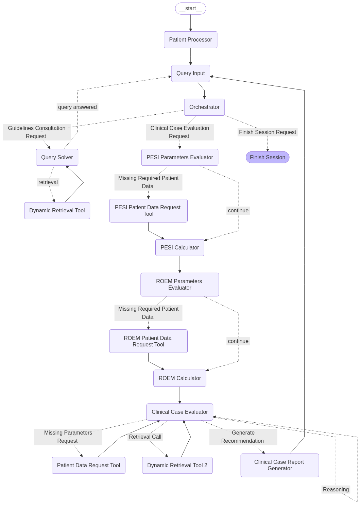

# Reasoning Clinical Decision Support System for Pulmonary Embolism

[](https://www.python.org/)
[](https://langchain-ai.github.io/langgraph/)


## Overview

This repository contains a **Clinical Decision Support System (CDSS)** designed to assist healthcare professionals in the diagnosis and treatment of Pulmonary Embolism (PE). The system integrates Large Language Models Agents with Retrieval-Augmented Generation to provide evidence-based clinical asssitance grounded in official medical guidelines.

The system is built using an agent-based architecture that combines autonomous reasoning, dynamic information retrieval, and decision-making capabilities to interpret clinical guidelines and generate personalized recommendations for patient care.

## Key Features

### 🔍 **Two Primary Services**

#### 1. **Guidelines Consultation Service**
- Allows healthcare professionals to query official PE clinical guidelines
- Provides evidence-based answers with source citations
- Supports complex clinical reasoning and interpretation
- Includes hallucination detection to ensure response accuracy

#### 2. **Clinical Case Evaluation Service**
- Integrates structured patient data for personalized recommendations
- Calculates clinical risk metrics (PESI, sPESI, Risk of Early Mortality)
- Generates personalized diagnostic and treatment recommendations
- Considers patient-specific contraindications and clinical context

### 🏗️ **Advanced Architecture**

- **Agent-Based System**: Multi-agent workflow using LangGraph
- **RAG Integration**: Retrieval-Augmented Generation for grounded responses
- **Hallucination Detection**: Built-in verification system for medical safety
- **Dynamic Retrieval**: Intelligent information retrieval based on clinical context
- **Structured Workflows**: Step-by-step clinical reasoning process

## Repository Structure

```
├── app.py                                  # Main application entry point
├── CDSS_demo.ipynb                         # Interactive Jupyter notebook demo
├── graph.png                               # Visual representation of the CDSS graph
├── .env.example                            # Example environment variables configuration
├── requirements.txt                        # Python dependencies
├── README.md                               # This file
│
├── data/                                   # Clinical data and guidelines
│   ├── clinical_cases/                         # Patient Database
│   │   ├── clinical_cases.xlsx                     # Patient case datasets
│   │   └── pe_scores_gt.xlsx                       # Ground truth PE scores
│   │
│   └── medical_guidelines/                     # PE Clinical Guidelines
│       ├── processed_markdown/                     # Processed guideline documents
│       └── raw/                                    # Original PDF guidelines
│
├── src/                                    # Source code
│   ├── graph_compilation.py                    # LangGraph graph compilation
│   ├── llm_config.py                           # LLM configuration
│   │
│   ├── custom_config/                          # Custom configurations
│   │   ├── state_schema.py                         # State management schema
│   │   ├── custom_messages.py                      # Custom message types
│   │   └── routing_functions.py                    # Workflow routing logic
│   │
│   ├── nodes/                                  # Agent nodes
│   │   ├── common_nodes.py                         # Intial and shared nodes
│   │   ├── guidelines_consultation_nodes.py        # Guidelines query agents
│   │   ├── clinical_case_evaluation_nodes.py       # Clinical evaluation agents
│   │   └── metrics_calculation_nodes.py            # PESI/sPESI calculation
│   │
│   └── services/                               # Core services
│       ├── retrieval.py                            # Document retrieval
│       ├── re_ranking.py                           # Result re-ranking
│       ├── ingestion_functions.py                  # Document processing
│       ├── hallucination_detector.py               # Response verification
│       └── tools.py                                # LangGraph tools
│
├── ingestion/                              # Document ingestion pipeline
│   └── Ingestion.ipynb                         # Document processing notebook
│
├── vectorstores/                           # Vector databases
│   └── pe_protocol/                            # PE guidelines vectorstore
│
└── experimental_results/                   # Evaluation results and datasets
    ├── clinical_case_evaluation_results/       # Clinical case evaluation results
    │   ├── evaluation_by_patient/                  # Individual patient evaluation
    │   ├── clinical_case_evaluation_dataset.json   # Dataset with the CDSS final responses
    │   └── experts_evaluation_results.ods          # Expert validation results
    │
    └── guidelines_consultation_results/        # Guidelines consultation results
        ├── evaluation_questions/                   # Test questions
        ├── questions_results_by_difficulty/        # Results by question difficulty
        ├── questions_results_dataset.json          # Dataset with the CDSS final responses
        └── evaluation_score_results.ods            # Performance scores
```

## Installation

### Prerequisites

- Python 3.11 or higher
- OpenAI API key

### Setup Instructions

1. **Clone the repository**:
   ```bash
   git clone <repository-url>
   ```

2. **Create and activate a virtual environment**:

    - Using ``venv``:

    ```bash
    python -m venv <environment-name>

    # On Windows
    venv\Scripts\activate

    # On macOS/Linux
    source venv/bin/activate
    ```

    - Using ``conda``:

    ```bash
    # Create the environment
    conda create -n <environment-name> python=3.11

    # Activate the environment
    conda activate <environment-name>
    ```

3. **Install dependencies**:
   ```bash
   pip install -r requirements.txt
   ```

4. **Set up environment variables**:

   Create a `.env` file in the root directory:
   ```env
   OPENAI_API_KEY=your_openai_api_key_here
   ```

## Usage

### Running the Application

#### Option 1: Command Line Interface
```bash
cd <path-to-repository>
python app.py
```

#### Option 2: Interactive Jupyter Notebook
```bash
jupyter notebook CDSS_demo.ipynb
```

### System Workflow

1. **Patient Selection**: Choose a patient from the clinical cases dataset (Patients 1-20)
2. **Service Selection**: 
   - **Guidelines Consultation**: Ask questions about PE clinical guidelines
   - **Clinical Case Evaluation**: Ask to get personalized recommendations for the selected patient
3. **Interactive Process**: The system will guide you through the clinical reasoning process
4. **Results**: Receive evidence-based recommendations with source citations

### Example Queries

#### Guidelines Consultation
- "What are the diagnostic criteria for pulmonary embolism?"
- "When should thrombolytic therapy be considered?"
- "What are the contraindications for anticoagulation?"

#### Clinical Case Evaluation
- "Help me with this clinical case"
- "How should I proceed with the selected patient?"
- "Analyze this patient"

## Document Ingestion

The system includes a complete pipeline for ingesting new medical documents and creating vector stores.

### Using the Ingestion Pipeline

1. **Open the ingestion notebook**:
   ```bash
   jupyter notebook ingestion/Ingestion.ipynb
   ```

2. **PDF to Markdown Conversion**:
   - Uses Docling for accurate medical document conversion
   - Preserves document structure and formatting
   - Handles tables, figures, and references

3. **Document Processing**:
   - Intelligent chunking using markdown headers
   - Metadata extraction and cross-reference handling
   - Duplicate content removal

4. **Vector Store Creation**:
   - Uses OpenAI embeddings (text-embedding-3-large)
   - Stores in Chroma vector database
   - Supports semantic search and retrieval

### Ingestion Steps

```python
# 1. Convert PDF to Markdown
convert_pdf_to_markdown(pdf_path, markdown_path)

# 2. Process markdown files
markdown_documents = read_markdown_files(markdown_folder)

# 3. Create vector store
vectorstore = Chroma.from_documents(
    documents=processed_chunks,
    embedding=OpenAIEmbeddings(model="text-embedding-3-large"),
    collection_name="your_collection_name",
    persist_directory="vectorstores/your_directory"
)
```

## System Architecture: Complete Node Graph

The CDSS system is built as a sophisticated multi-agent workflow using LangGraph. Below is the complete system architecture showing all nodes and their relationships:



### Complete Node Breakdown

#### 🏁 **Entry Point Nodes**
- **START**: System initialization point
- **Patient Processor**: Loads patient data from Excel files, handles patient selection (1-20), and initializes patient state
- **Query Input**: Manages user input and query processing, handles interactive communication with healthcare professionals
- **Orchestrator**: Central routing agent that classifies queries and directs them to appropriate service pathways

#### 📋 **Guidelines Consultation Pathway**
- **Query Solver**: Main agent for processing clinical guideline queries, performs multi-step reasoning and coordinates information retrieval
- **Dynamic Retrieval Tool**: Retrieves relevant information from PE guidelines vectorstore, supports semantic search and re-ranking

#### 🏥 **Clinical Case Evaluation Pathway**

##### Clinical Metrics Calculation
- **PESI Parameters Evaluator**: Identifies required parameters for PESI/sPESI calculation, checks for missing patient data
- **PESI Patient Data Request Tool**: Requests missing patient data specifically for PESI calculation
- **PESI Calculator**: Computes PESI (Pulmonary Embolism Severity Index) and sPESI (Simplified PESI) scores for mortality risk assessment


- **ROEM Parameters Evaluator**: Identifies parameters needed for Risk of Early Mortality calculation
- **ROEM Patient Data Request Tool**: Requests missing patient data for mortality risk assessment
- **ROEM Calculator**: Calculates comprehensive Risk of Early Mortality classification

##### Clinical Decision Making
- **Clinical Case Evaluator**: Multi-turn reasoning agent that:
  - Analyzes patient data and calculated metrics
  - Performs clinical reasoning across multiple steps
  - Coordinates information retrieval and data requests
  - Prepares for final recommendation generation
- **Patient Data Request Tool**: General tool for requesting missing patient parameters during clinical evaluation
- **Dynamic Retrieval Tool 2**: Secondary retrieval tool for guidelines information during clinical evaluation
- **Clinical Case Report Generator**: Generates final clinical recommendations with:
  - Patient state assessment
  - Diagnosis determination
  - Diagnostic/Treatment recommendations
  - Safety considerations and contraindications

#### 🔚 **Session Management**
- **Finish Session**: Handles session termination and cleanup

### Node Interaction Flow

1. **Initialization**: START → Patient Processor → Query Input → Orchestrator
2. **Guidelines Consultation**: Orchestrator → Query Solver ⇄ Dynamic Retrieval Tool → Query Input
3. **Clinical Evaluation**: Orchestrator → PESI Parameters Evaluator → PESI Calculator → ROEM Parameters Evaluator → ROEM Calculator → Clinical Case Evaluator → Clinical Case Report Generator → Query Input
4. **Data Requests**: Any evaluator can route to data request tools when patient information is missing
5. **Information Retrieval**: Clinical Case Evaluator can call Dynamic Retrieval Tool 2 for additional guideline information
6. **Session End**: Any point → Finish Session

### Key Features of the Architecture

- **Conditional Routing**: Smart routing based on agent decisions and patient data availability
- **Memory Persistence**: LangGraph checkpoint system maintains conversation state
- **Uncertainty Handling**: Robust handling of missing data and failed operations
- **Multi-turn Reasoning**: Agents can perform multiple reasoning steps before generating final outputs
- **Safety Checks**: Built-in verification and hallucination detection at multiple stages

## Safety Features

- **Hallucination Detection**: Prevents unsafe or inaccurate recommendations
- **Contraindication Checking**: Automatically considers patient-specific contraindications
- **Evidence-Based Responses**: All recommendations are grounded in official guidelines
- **Transparent Reasoning**: Provides step-by-step clinical reasoning
- **Source Citation**: All responses include references to source documents

## Evaluation

The system has been evaluated using:
- **Clinical Case Evaluation Dataset**: 20 simulated patient cases
- **Guidelines Consultation Dataset**: Clinical questions with three difficulty levels
- **Expert Validation**: Clinical expert review of recommendations
- **Automated Metrics**: Context precision, relevance, and factual accuracy

## Research Publication

This system is part of a research study: *"Reasoning Clinical Decision Support System with Large Language Model Agents: A Case Study in Pulmonary Embolism"*

The research demonstrates the effectiveness of agent-based LLM systems in clinical decision support, with particular focus on pulmonary embolism management.

## Contact

For questions or support, please contact the research team or open an issue in this repository.

---

⚠️ **Important Medical Disclaimer**: This system is designed for research purposes and to assist healthcare professionals. It should not replace professional medical judgment or be used as the sole basis for clinical decisions. Always consult with qualified healthcare providers for patient care decisions.
